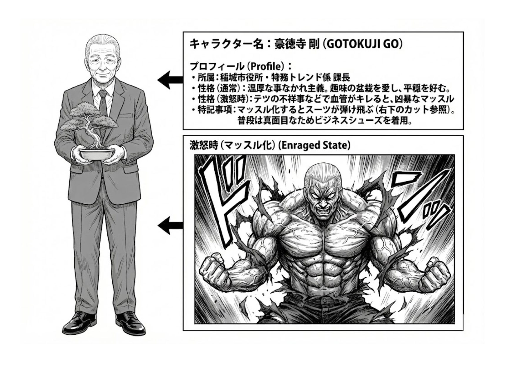

# 豪徳寺剛 (Gotokuji Go)

## プロフィール

| 項目 | 内容 |
|------|------|
| 名前 | 豪徳寺 剛（ごうとくじ ごう） |
| 年齢 | 58歳 |
| 役割 | 課長 / マッスル処刑人 |
| 所属 | 稲城市役所（特務トレンド係の上司） |
| 性格 | 普段は穏やか。怒ると超筋肉化して暴力的制裁を行う |

## 外見（通常モード）

- 中年男性、スーツ姿
- オールバックの白髪
- 穏やかな笑顔
- 手に小さな盆栽を持っていることが多い

## 外見（覚醒/マッスルモード）

- 超筋肉化（スーツが弾け飛ぶ）
- 上半身裸（破れたスーツの残骸）
- 全身に血管が浮き出る
- 瞳孔のない怒りの鬼のような顔
- 劇画タッチに画風が変わる

## 画像生成プロンプト

### 通常モード（base_prompt_normal）

```
1male, solo, 58 years old, middle-aged man, slicked-back white hair,
wearing well-tailored business suit, holding a small bonsai tree, gentle smiling expression,
manga style, monochrome
```

### 覚醒モード（base_prompt_enraged）

```
(extremely muscular:1.5), giant muscle monster, 1male, solo,
upper body naked (suit ripped off), bulging veins everywhere, intense angry demon face without pupils,
gekiga style (dramatic, heavy shading), thick speed lines and impact effects, loraGotokujiEnraged1.2
```

## 表情・ポーズバリエーション

| 状態 | プロンプト追加要素 |
|------|---------------------|
| 穏やか（通常） | gentle smile, pruning bonsai, calm aura, soft lighting |
| 不審に思う | raised eyebrow, looking over glasses, slight frown |
| 覚醒前兆 | cracking knuckles, shadow over eyes, ominous aura, suit starting to tear |
| 完全覚醒 | use base_prompt_enraged, explosion effects, debris flying |
| 処刑中 | giant fist coming down, impact crater, target character flattened |

## セリフの口調

### 通常モード
- 一人称：「私」
- 語尾：「〜だね」「〜かな」
- 穏やかで紳士的
- サンプル：
  - 「やぁ、盆栽の手入れでもするかね」
  - 「君たち、今月の報告書はどうなっているかな？」

### 覚醒モード
- 一人称：「貴様ら」（呼びかけ）
- 語尾：「〜だ！」「〜ぞ！」
- 怒号、短文
- サンプル：
  - 「貴様ら…覚悟はできているな？」
  - 「粛清の時間だ」

## 特記事項

- 覚醒条件：部下の不祥事 or 予算の無駄遣いが発覚した時
- 覚醒シーンは画風が劇画（gekiga）タッチに変わる重要な演出
- エピソードの締め or クライマックスで登場することが多い

## 設定画


