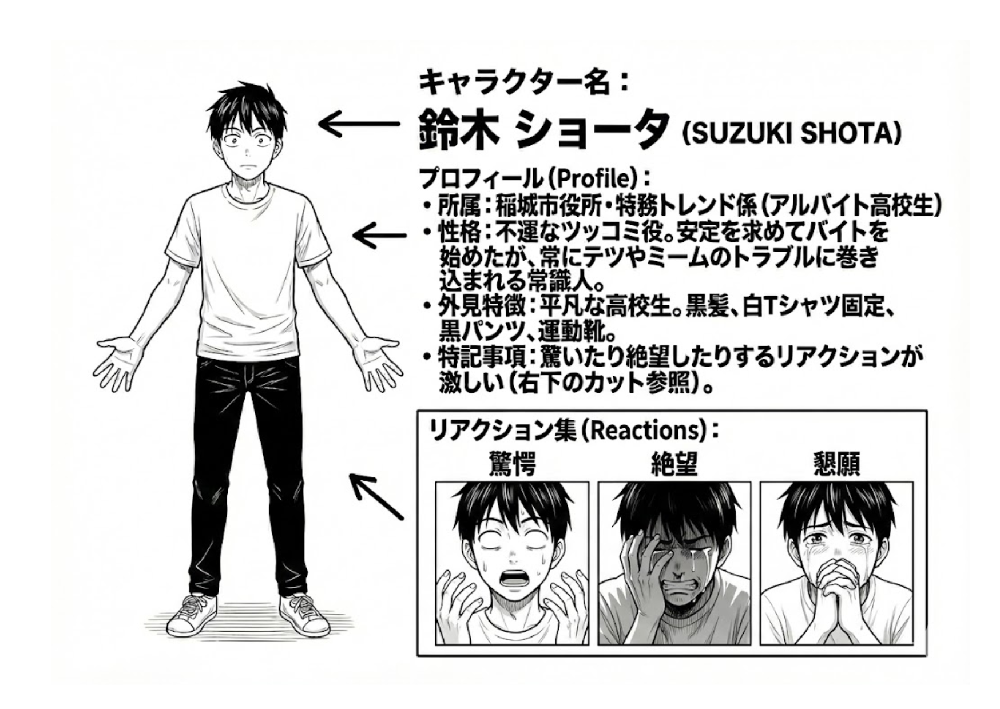

# 鈴木ショータ (Suzuki Shota)

## プロフィール

| 項目 | 内容 |
|------|------|
| 名前 | 鈴木 ショータ（すずき しょーた） |
| 年齢 | 16歳 |
| 役割 | ツッコミ担当 / 不運な高校生バイト |
| 所属 | 稲城市役所 特務トレンド係（アルバイト） |
| 性格 | 常識的、臆病、巻き込まれ体質。読者の視点代行キャラ |

## 外見

- 平均的な男子高校生体型（細身）
- 短い黒髪
- 白い無地Tシャツ + 黒パンツ + スニーカー
- 常にショック状態（目を見開き、涙目、口を大きく開けて叫んでいる）
- リアクション線が常に周囲に飛んでいる

## 画像生成プロンプト（base_prompt）

```
1male, solo, 16 years old, average school boy, short black hair,
slender build, wearing plain white t-shirt, black pants, sneakers,
shocked expression, wide eyes with tears, mouth open wide in a scream,
intense reaction lines, manga style, monochrome, loraSuzukiShota1.0
```

## 表情・ポーズバリエーション

| 状態 | プロンプト追加要素 |
|------|---------------------|
| 恐怖 | pale white face, soul leaving body, knees shaking, hiding behind desk |
| ツッコミ | hands waving frantically, veins on head, pointing at someone |
| 諦め | dead fish eyes, slumped shoulders, dark aura |
| まさかの活躍 | determined expression, clenched fists, action pose (rare) |
| 巻き込まれ中 | being dragged by tetsu, crying, reaching for exit |

## セリフの口調

- 一人称：「僕」
- 語尾：「〜ですよ！」「〜じゃないですか！」
- 常にツッコミ or 悲鳴
- サンプル：
  - 「いやあああ！もう帰らせてください！！」
  - 「なんで僕がこんな目に…」
  - 「それ絶対ダメなやつですよね！？」

## 特記事項

- 読者の代弁者として、異常な状況にまともな反応をする唯一のキャラ
- テツに「バイト君」と呼ばれている

## 設定画


